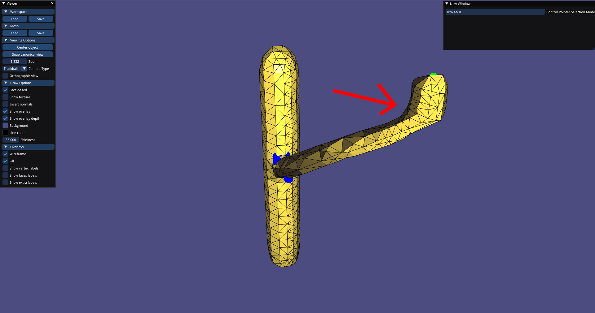

# ARAP (As-rigid-as-possible) and OpenGL Viewer

<div>
    
    
</div>

<div>
    
    
</div>

## Getting Started

CMake build system should automatically install dependencies. If there is problem, please make sure to install following:

- STL
- Eigen
- libigl

## Running the project

You need to compile the project like following.

```sh
$ mkdir build
$ cd build
$ cmake ..
$ make
```

And run the project using

```sh
$ ./arap_cpp ../data/<mesh_obj>.off
```

Or for the video generating sake (This is for our internal usage. No need to test)

```sh
$ ./arap_cpp video <mesh_path> <video_path>
```

## How to use GUI

```
C,c     Switch controlling point type (Your chosen type can be displayed on right top)
V,v     Save the controlling point
G,g     Toggle grabbing mode. (Toggle it, and give a vector with your mouse)
```

You need to at least choose dynamic points for ARAP to work.

### Mesh objects

GUI only tested with `../data/cactus_small.off` or `../data/armadillo_1k.off`. You can test with other mesh files as well. Please use the recommended ones if you face with any problem.

## Tested environment

- Operating System: Fedora 37
- No GPU needed

## Authors

- **Hakan Alp** - _GUI work and maintain_ - [hakanalpp](https://github.com/hakanalpp)
- **Burak Berk Ozer** - _GUI work_ - [burakberk](https://github.com/burakberk)
- **Nur Gizem Altintas** - _ARAP implementation_ - [gizemaltintas](https://github.com/gizemaltintas)
- **Umut Kocasari** - _ARAP implementation_ - [kocasariumut](https://github.com/kocasariumut)
